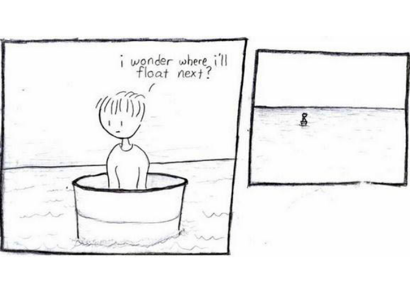

<!-- README.md is generated from README.Rmd. Please edit that file -->

# xkcd

<!-- badges: start -->
<!-- badges: end -->

The `xckd` package provides an R interface to retrieve data about [xkcd
comics](https://xkcd.com/) from the xkcd website - and most importantly,
view those comics in your plot window!

## Installation

You can install the development version of xkcd from
[GitHub](https://github.com/) with:

``` r
# install.packages("devtools")
devtools::install_github("wjhopper/xkcd")
```

## Browsing comics

Given a comic number, the `xkcd()` function retrieves a JSON object with
metadata about that comic.

``` r
library(xkcd)

# Retrieve data about the first xkcd comic ever!
first_comic <- xkcd(1)
first_comic
#> $month
#> [1] "1"
#> 
#> $num
#> [1] 1
#> 
#> $link
#> [1] ""
#> 
#> $year
#> [1] "2006"
#> 
#> $news
#> [1] ""
#> 
#> $safe_title
#> [1] "Barrel - Part 1"
#> 
#> $transcript
#> [1] "[[A boy sits in a barrel which is floating in an ocean.]]\nBoy: I wonder where I'll float next?\n[[The barrel drifts into the distance. Nothing else can be seen.]]\n{{Alt: Don't we all.}}"
#> 
#> $alt
#> [1] "Don't we all."
#> 
#> $img
#> [1] "https://imgs.xkcd.com/comics/barrel_cropped_(1).jpg"
#> 
#> $title
#> [1] "Barrel - Part 1"
#> 
#> $day
#> [1] "1"
#> 
#> attr(,"class")
#> [1] "xkcd"
```

The most useful thing you can do with these objects is plot them, which
displays the comic image in your plot window.

``` r
plot(first_comic)
```



## Comic Data

The metadata from all 2,850 xkcd comics (so far) is aggregated into the
`xkcd_data` data set

``` r
head(xkcd_data)
#>   num year month day link news                title           safe_title
#> 1   1 2006     1   1                Barrel - Part 1      Barrel - Part 1
#> 2   2 2006     1   1           Petit Trees (sketch) Petit Trees (sketch)
#> 3   3 2006     1   1                Island (sketch)      Island (sketch)
#> 4   4 2006     1   1             Landscape (sketch)   Landscape (sketch)
#> 5   5 2006     1   1                    Blown apart          Blown apart
#> 6   6 2006     1   1                          Irony                Irony
#>                                                                                                                                                                                                                                                                                                                                                            transcript
#> 1                                                                                                                                                                         [[A boy sits in a barrel which is floating in an ocean.]]\nBoy: I wonder where I'll float next?\n[[The barrel drifts into the distance. Nothing else can be seen.]]\n{{Alt: Don't we all.}}
#> 2                                                                                                                                                                                        [[Two trees are growing on opposite sides of a sphere.]]\n{{Alt-title: 'Petit' being a reference to Le Petit Prince, which I only thought about halfway through the sketch}}
#> 3                                                                                                                                                                                                                                                                                                                    [[A sketch of an Island]]\n{{Alt:Hello, island}}
#> 4                                                                                                                                                                                                                                                             [[A sketch of a landscape with sun on the horizon]]\n{{Alt: There's a river flowing through the ocean}}
#> 5                                                                                                  [[A black number 70 sees a red package.]]\n70: hey, a package!\n[[The package explodes with a <<BOOM>> and a red cloud of smoke.]]\n[[There are a red 7, a green 5 and a blue 2 lying near a scorched mark on the floor.]]\n{{alt text: Blown into prime factors}}
#> 6 Narrator: When self-reference, irony, and meta-humor go too far\nNarrator: A CAUTIONARY TALE\nMan 1: This statement wouldn't be funny if not for irony!\nMan 1: ha ha\nMan 2: ha ha, I guess.\nNarrator: 20,000 years later...\n[[desolate badlands landscape with an imposing sun in the sky]]\n{{It's commonly known that too much perspective can be a downer.}}
#>                                                                                                   alt
#> 1                                                                                       Don't we all.
#> 2 'Petit' being a reference to Le Petit Prince, which I only thought about halfway through the sketch
#> 3                                                                                       Hello, island
#> 4                                                           There's a river flowing through the ocean
#> 5                                                                            Blown into prime factors
#> 6                                      It's commonly known that too much perspective can be a downer.
#>                                                      img
#> 1    https://imgs.xkcd.com/comics/barrel_cropped_(1).jpg
#> 2      https://imgs.xkcd.com/comics/tree_cropped_(1).jpg
#> 3          https://imgs.xkcd.com/comics/island_color.jpg
#> 4 https://imgs.xkcd.com/comics/landscape_cropped_(1).jpg
#> 5      https://imgs.xkcd.com/comics/blownapart_color.jpg
#> 6           https://imgs.xkcd.com/comics/irony_color.jpg
```
